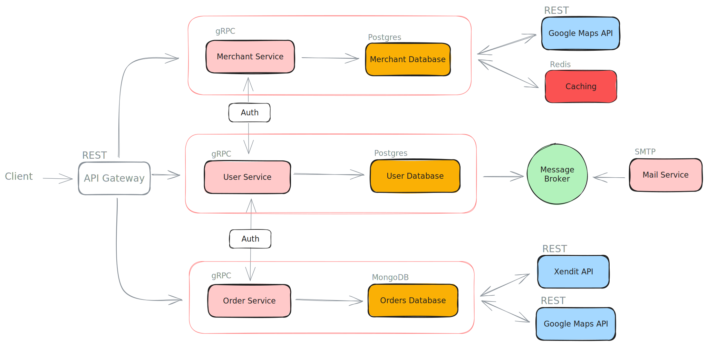

# Jeki

## Background:

> Food delivery application that integrates customer, driver, and restaurant services seamlessly.

## Highlights:

* Google Maps Integration
* Payment Gateway (Xendit)
* Email notifications

### Tech stacks:

* Go
* Echo
* gRPC
* PostgreSQL
* MongoDB
* Redis
* JWT-Authorization
* 3rd Party APIs (Xendit, Google Maps)
* SMTP
* REST
* Swagger
* Testify

## Application Flow

## ERD

### User Service (Postgres)

### Merchant Service (Postgres)

### Order Service (MongoDB)

